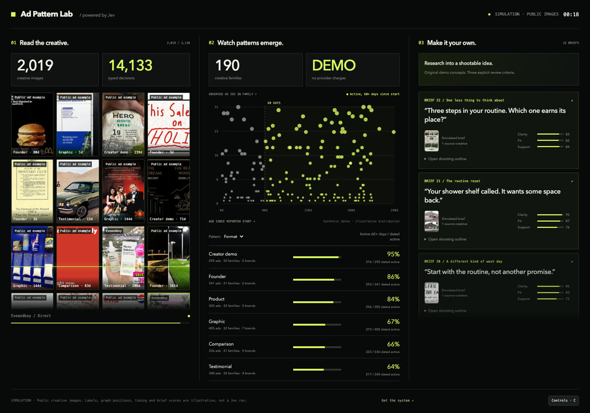

# Ad Pattern Lab

**Turn a pile of ads into a research library and your next creative brief.** A local Jev app with a ready-to-record simulation, imports, free local OCR and an optional Meta Ad Library collection connector.



[Watch the simulation](docs/demo.mp4) · [Full setup guide](docs/SETUP.md) · [Validation status](docs/VALIDATION.md) · [Data flow](docs/PRIVACY.md) · [Image sources](docs/IMAGE-SOURCES.md)

## Start with no keys

Install [Node.js](https://nodejs.org/en/download) 22.9 or newer, then:

```sh
git clone https://github.com/artemnovitckii/ad-pattern-lab.git
cd ad-pattern-lab
npm ci
npm run setup
npm start
```

Open **http://127.0.0.1:5194**. Press **Play simulation**. The ad wall, map and briefs advance together. No provider requests happen in Simulation mode.

Record a clean 20-second version at:

```text
http://127.0.0.1:5194/?clean=1&autoplay=1&duration=20
```

Add `&portrait=1` for a taller composition. `C` toggles controls, `R` restarts, and Space pauses. The timer is replay time, not measured API speed. The starter uses fictional brands and generated creatives. An optional local image pack replaces the artwork with public examples. In both modes the dates, labels, graph positions and brief scores are synthetic. It is not a campaign case study.

## Want a wall with thousands of images?

For the larger visual, run `npm run demo:download` after installing FFmpeg. This downloads a curated list of small public reference images from Swipefile into your local cache, with source links. Some are digital ads, some are print or other marketing examples; this is not a current Meta campaign dataset. Availability can change.

Or import your own local image folder with `npm run demo:images -- /path/to/images` (requires FFmpeg). The app compresses thumbnails, deduplicates exact files and renders only the visible cards. Source links can be preserved with a file manifest. [Image-pool setup](docs/SETUP.md#use-hundreds-or-thousands-of-your-own-demo-images). The public starter includes 16 generated examples; external image libraries stay local and are not part of the code license.

## Three ways in

| Mode | What it does | Required keys |
| --- | --- | --- |
| Simulation | Replays bundled fictional ads and briefs | None |
| Import ads | Paste copy, import JSON, upload images or videos | Jev for classification; optional speech provider |
| Meta collection | Starts or attaches an Apify run and imports its results | Apify, then Jev for analysis |

**Beta:** the paid Apify, speech and writing connectors are implemented but have not been validated with paid live runs. Jev request/response handling is contract-tested with mocked responses. See the exact [verification record](docs/VALIDATION.md). Start with a small batch and check the original ads and provider billing.

## Where Jev fits

1. **Collect or import** public ad records and their available source links, dates and media.
2. **Extract words.** Tesseract.js runs OCR locally. Videos use FFmpeg to sample four frames. Fireworks or Groq optionally transcribes speech.
3. **Jev classifies** seven dimensions in one typed request: format, hook, angle, offer, proof, objection and CTA. It receives the words and supplied visual notes, not age or performance metrics.
4. **Explore patterns.** Filter the wall and map by a pattern. Compare the share of dated active ads that started at least 60 days before collection. Click a creative to inspect labels and evidence.
5. **Make original briefs.** Supply your product, audience and verified facts. An optional OpenAI-compatible writer drafts original briefs; without one, you get editable outlines. Jev reviews clarity, brand fit and claim support.

Jev handles bounded classification and rubric review. It does not read image pixels or write the long-form briefs in this implementation. OCR alone cannot establish that a video is a talking-head demo. Supply `visualNotes`, or accept an unknown format.

## What the map means

Each point is an exact fingerprint family, placed by **median age of its dated active records** and **number of observed ad IDs**. Families match normalized copy plus media URL or supplied text evidence. Signed URL changes and small copy edits can split visually identical creatives; this is not perceptual deduplication.

The table shows **active ads aged 60+ days / active ads with known dates**, with sample and family counts. Multiple ad IDs can represent variants, placements or duplication; the app does not claim they are distinct creative tests. Active-only snapshots have selection bias and cannot measure survival probabilities. Age since a reported start is not continuous delivery, profitability, CTR, CPA or ROAS.

Brief scores are explicit model judgments, not sales forecasts. This tool helps select examples and write hypotheses to test in your own account.

## Bring your own evidence

Import [examples/sample-ads.json](examples/sample-ads.json) to see the schema. It is fictional and labeled accordingly. JSON imports and pasted copy replace the current local batch; uploads append. Export any batch you want to retain first.

Add your own `TYPESAFE_API_KEY` to `.env`, restart, choose **Import ads**, then **Analyze / retry unfinished**. Image OCR itself has no API fee. First use downloads the English OCR model. For videos, install FFmpeg and configure one speech provider if you need the spoken words.

```dotenv
TYPESAFE_API_KEY=your_typesafe_key
TRANSCRIPTION_PROVIDER=fireworks
FIREWORKS_API_KEY=your_fireworks_key
# Or use TRANSCRIPTION_PROVIDER=groq and GROQ_API_KEY=...
```

Full collection, writer configuration, Windows/Mac setup, limits and troubleshooting: **[docs/SETUP.md](docs/SETUP.md)**.

## Local-first, not offline-only

The app binds to `127.0.0.1`. Keys stay server-side in `.env`. Local data and caches live in ignored `data/`. The chosen providers receive only the material needed for their stages. Exports include ad text and analysis, so review them before publishing. Do not expose this development server to the internet. [Details](docs/PRIVACY.md).

```sh
npm run doctor  # Tool and key presence only; no paid requests
npm run check
npm test
```

Built by [Artem Novitckii](https://novitckii.com). Independent of Meta, Apify and TypeSafe. Code is MIT licensed. Bundled demo artwork is AI-generated and depicts fictional campaigns; it is included for illustrative demos, not as product claims or endorsements.
